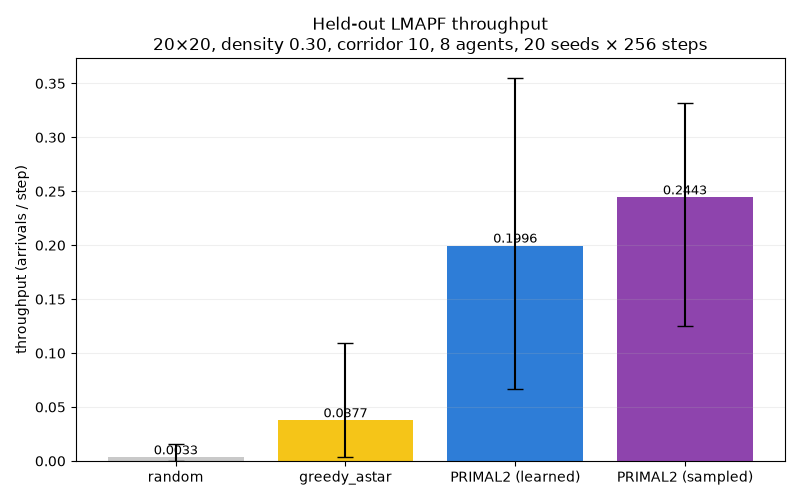
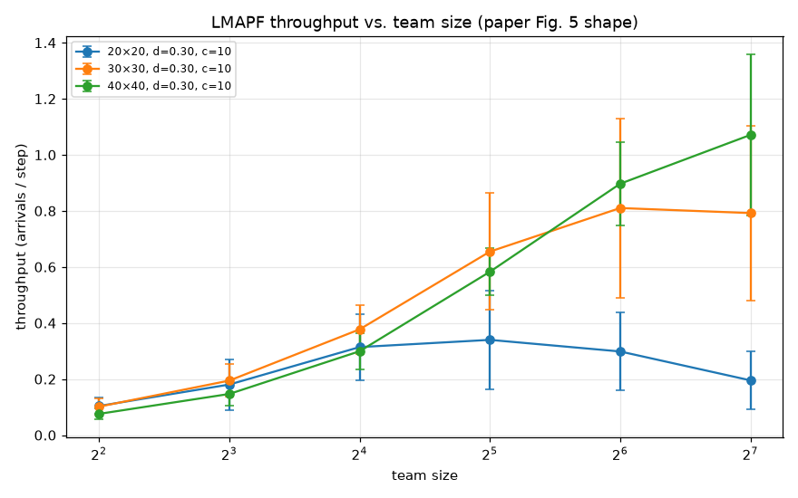

# PRIMAL2 Toy Example

A small, from-scratch reimplementation of **PRIMAL2** (Damani, Luo, Wenzel, Sartoretti — *"PRIMAL2: Pathfinding via Reinforcement and Imitation Multi-Agent Learning - Lifelong"*, RA-L 2021, [arXiv:2010.08184](https://arxiv.org/abs/2010.08184)) intended for a seminar demo.

The paper trains a fully decentralized, communication-free policy for **lifelong multi-agent path finding (LMAPF)** in dense, corridor-heavy grid worlds. Each agent observes only an 11×11 local FOV enriched with A* path hints and corridor-structure channels, and is trained with a mix of A3C, imitation learning from a centralized expert, and a supervised "convention" loss.

This repo re-implements the paper *as faithfully as is feasible* at a small training scale (a few hours on a laptop), so you can run it live during a seminar.



## Headline result

On a held-out benchmark of 20 seeds × 256 steps, **20×20 world, 30 % density, corridor length 10, 8 agents** (the paper-adjacent LMAPF configuration):

| Method | Throughput (arrivals / step) | vs greedy A* |
| --- | ---:| ---:|
| random | 0.003 | 0.1× |
| greedy A* (independent) | 0.038 | 1.0× |
| **PRIMAL2 (learned, greedy)** | **0.200** | **5.3×** |
| **PRIMAL2 (learned, sampled)** | **0.244** | **6.5×** |

On the harder 40×40 / 16-agent LMAPF benchmark: **PRIMAL2 sampled 0.365 (3.8× greedy A*)**. On the smaller 15×15 / 6 agent benchmark: **PRIMAL2 sampled 0.207 (11.1× greedy A*)**.

The trained policy also **never deadlocks** in any tested configuration — its worst-seed throughput stays ≥ 0.098, whereas greedy A* hits 0 arrivals on several seeds.

See [`docs/EVALUATION.md`](docs/EVALUATION.md) for the full write-up.



## What's in this repo

| Module | What it does |
| --- | --- |
| `primal2_toy/env/` | 2D 4-connected grid, wall-drop maze generator, corridor decomposition, LMAPF/one-shot task manager. |
| `primal2_toy/obs/` | Builds the 13-channel FOV observation (obstacles, own goal, other agents, other goals, A* path-length map, ΔX/ΔY/blocking, three future-position prediction maps) + 3 goal-vector scalars. |
| `primal2_toy/expert/` | Prioritized-planning space-time A* to generate collision-free expert demonstrations for IL episodes. |
| `primal2_toy/policy/` | Paper's exact network (2× VGG blocks → 1×1 conv → concat with goal-FC → 2× FC → LSTM with residual → π, V) plus the four losses (value, actor+entropy, valid/BCE, BC). |
| `primal2_toy/train/` | Training loop: env randomization per episode, 50/50 RL/IL dispatch, NAdam with inverse-sqrt LR decay, checkpointing, CSV logging. |
| `primal2_toy/eval/` | Pygame visualizer, headless evaluator, sweep runner, random & greedy-A* baselines, live watchdog. |
| `demo.py` | Live-demo entry point. |

Design notes and dev log:

- [`docs/superpowers/specs/2026-07-02-primal2-toy-example-design.md`](docs/superpowers/specs/2026-07-02-primal2-toy-example-design.md)
- [`docs/dev-log.md`](docs/dev-log.md)
- [`docs/EVALUATION.md`](docs/EVALUATION.md)

## Faithfulness to the paper

- **Network:** exact — Section IV.D.
- **Observation channels:** all 13 as described in Section IV.A + Fig. 3.
- **Losses:** value + actor with entropy bonus (Eq. 1), advantage from bootstrapped value (Eq. 2), valid/BCE loss (Eq. 3), behavior cloning (Eq. 4).
- **Reward structure:** `-0.3` off goal, `+5` on goal, `-2` on collision (Section IV.C).
- **Training recipe:** NAdam, lr `5e-5` (paper uses `2e-5`; bumped for the single-worker setting), inverse-sqrt decay, γ=0.95, RL episodes 256 steps, IL episodes 64 steps, RL/IL ratio 0.5 (Section V.B).
- **Env randomization:** size, obstacle density, corridor length per episode.

## Documented deviations

- Distributed backend: single Python process (paper uses Ray with 9 workers). Main compute gap.
- Expert planner: prioritized-planning multi-agent A* stand-in for ODrM* (same role, simpler code, still produces valid demonstrations).
- Scale: shipped model trained on worlds ∈ {20, 30, 40}, density 0.3–0.5, corridor 5/10/15, 8 agents (paper: 10–70 / 0.2–0.7 / 3–21, up to 2048 agents).
- Effective training: ~25 k episodes across two chained warm-starts, ~15 h wall-clock total (paper: ~35 k episodes × 9 workers × ~10 h).

## Quickstart

```bash
python -m venv .venv && source .venv/bin/activate
pip install numpy torch pygame matplotlib tqdm

# Live demo with the shipped trained checkpoint:
python demo.py --checkpoint checkpoints/primal2_final.pt --size 20 --agents 8 --seed 42 --fps 4

# Try the harder Fig-5 configurations:
python demo.py --checkpoint checkpoints/primal2_final.pt --size 40 --agents 32 --seed 42 --fps 2

# Empty-room variant (no obstacles, no corridors):
python demo.py --checkpoint checkpoints/primal2_final.pt --size 20 --agents 8 --seed 42 --no-corridors --fps 4

# Baselines for comparison:
PYTHONPATH=. python -m primal2_toy.eval.baselines --baseline random --agents 8 --size 20
PYTHONPATH=. python -m primal2_toy.eval.baselines --baseline greedy_astar --agents 8 --size 20

# Rerun the held-out 20×20 comparison:
PYTHONPATH=. python -m primal2_toy.eval.compare \
    --checkpoint checkpoints/primal2_final.pt \
    --size 20 --density 0.3 --corridor-length 10 --agents 8 \
    --steps 256 --device cpu \
    --seeds 7 42 123 555 2024 8 91 314 777 1000 \
            33 66 200 400 800 1234 5678 9101 2222 3333
```

### Reproducing the paper's PRIMAL2 figures

`primal2_toy.eval.sweep` runs a Cartesian product over `(mode × size × density × corridor × team_size × seed)`. `primal2_toy.eval.sweep_plots` turns the resulting CSV into Fig-4-shape (one-shot: success rate + avg path length vs. team size) and Fig-5-shape (LMAPF: throughput vs. team size) plots.

```bash
# Fig-5 shape (LMAPF throughput vs. team size)
PYTHONPATH=. python -m primal2_toy.eval.sweep \
    --checkpoint checkpoints/primal2_final.pt \
    --mode lmapf --sizes 20 30 40 --densities 0.3 --corridors 10 \
    --team-sizes 4 8 16 32 64 128 --n-seeds 5 --device cpu \
    --out logs/sweep_fig5.csv
PYTHONPATH=. python -m primal2_toy.eval.sweep_plots \
    --sweep-csv logs/sweep_fig5.csv --out docs/images/fig5

# Fig-4 shape (one-shot success + path length vs. team size)
PYTHONPATH=. python -m primal2_toy.eval.sweep \
    --checkpoint checkpoints/primal2_final.pt \
    --mode oneshot --sizes 20 40 --densities 0.3 --corridors 10 \
    --team-sizes 4 8 16 32 64 --n-seeds 5 --device cpu \
    --out logs/sweep_fig4.csv
PYTHONPATH=. python -m primal2_toy.eval.sweep_plots \
    --sweep-csv logs/sweep_fig4.csv --out docs/images/fig4
```

Timestep budgets default to the paper's per-size values (Section VI.A/B).

### Retrain from scratch

`--paper-ranges` widens the training distribution to Section V.B.2 (sizes 10–70, density 0.2–0.7, corridor 3–21). Wall-clock on a modern GPU is ~10 h.

```bash
PYTHONPATH=. python -m primal2_toy.train.main \
    --paper-ranges --n-agents 8 --device cuda \
    --episodes 35000 --seed 42 --log-every 50 --ckpt-every 1000 \
    --warmstart-weights checkpoints/primal2_final.pt
```

The `--warmstart-weights` flag reuses the shipped checkpoint as an Adam-adapted starting point, shaving hours off the ramp-up phase.

### Demo controls

- `SPACE` — pause/resume
- `V` — toggle side panel showing the 11 spatial obs channels for the selected agent
- `Click on an agent` — select agent for the obs panel
- `R` — reset with a new random map
- `+ / -` — adjust FPS
- `ESC` — quit

## Repository layout

```
primal2_toy_example/
├── primal2.pdf                          # source paper
├── README.md
├── docs/
│   ├── EVALUATION.md                    # results write-up
│   ├── dev-log.md                       # narrative of the training runs
│   ├── images/                          # comparison + Fig-4/5 + screenshots
│   └── superpowers/specs/               # design doc
├── checkpoints/
│   └── primal2_final.pt                 # shipped trained model (ep 25 445)
├── primal2_toy/
│   ├── env/         grid.py maze.py corridor.py lmapf.py
│   ├── obs/         builder.py astar.py corridor_maps.py
│   ├── expert/      prioritized_astar.py
│   ├── policy/      network.py losses.py
│   ├── train/       config.py trainer.py validity.py main.py
│   └── eval/        rollout.py visualizer.py headless.py baselines.py monitor.py watchdog.py render_frame.py compare.py comparison_plot.py plots.py sweep.py sweep_plots.py
├── scripts/
│   ├── train_optB.sh                    # night-training launcher (paper-adjacent ranges)
│   └── watchdog_optB.sh                 # matching evaluation watchdog
├── demo.py
└── tests/                               # smoke tests for each module
```

Training-time artifacts (`logs/`, intermediate checkpoints) are gitignored — regenerable by running the training loop.
